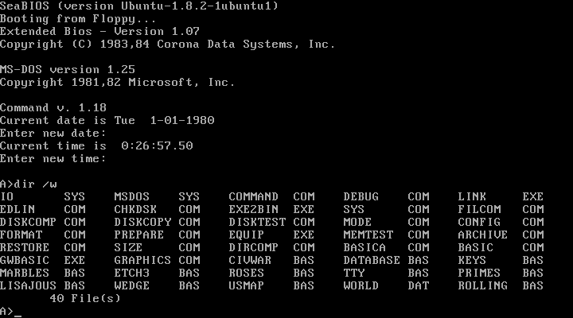

# Corona MS-DOS crashes qemu

Some rights reserved! Vintage technology preserved.

---

[Previous](../randomupdates2) | [Index](../../../../) | [Next]
--- | --- | ---

---

## April 1st is over

One could say retrocomputing is useless. Beyond any synesthetics
it's time to have a test drive with Corona MS-DOS 1.25 port in qemu!
This vintage MS-DOS is an OEM version for Corona Data Systems
computers.

Because the available disk image does not even have a valid boot
sector magic number word (55h, 0AAh), so qemu has to be forced to
ignore bootblock checks via parameter "-no-fd-bootchk". Other
settings become usual.

### Booting corona MS-DOS

Enter command line:

```
qemu-system-i386 -nodefaults -cpu 486 -machine accel=tcg \
    -no-fd-bootchk -vga std -monitor vc -m 1 -fda corona.img
```

- 

## Meet the bug

```
   \ | /
  ,-+++.
  ----| %
  `-+++'
   / | \

```

Because of the missing features of the command interpreter, namely
COMMAND.COM, does not even support ECHO nor PROMPT commands.
As a poor man's assembly, DEBUG.COM is more than enough to create
CLI tools for a time millionaire. However, randomly started some
binaries - and most of them forced qemu to collapse!

The most weird thing happend after launching MEMTEST.COM: it forced
qemu to exit regardless "-no-shutdown" was specified!

```
user@errorlevel:0:/tmp/1/Microsoft MS-DOS 1.25 [Corona Data Systems OEM (BIOS 1.07)] (5.25-320k)$ qemu-system-i386 -nodefaults -cpu 486 -machine accel=tcg -no-fd-bootchk -vga std -monitor vc -m 1 -fda corona.img -no-shutdown
WARNING: Image format was not specified for 'corona.img' and probing guessed raw.
         Automatically detecting the format is dangerous for raw images, write operations on block 0 will be restricted.
         Specify the 'raw' format explicitly to remove the restrictions.
warning: TCG doesn't support requested feature: CPUID.01H:EDX.vme [bit 1]
qemu: fatal: Trying to execute code outside RAM or ROM at 0x000b0d20

EAX=00000d20 EBX=00000000 ECX=00000000 EDX=00000154
ESI=00000f80 EDI=00000f80 EBP=000000c6 ESP=00000f80
EIP=00000d20 EFL=00000246 [---Z-P-] CPL=0 II=0 A20=1 SMM=0 HLT=0
ES =b000 000b0000 0000ffff 00009300
CS =b000 000b0000 0000ffff 00009b00
SS =0316 00003160 0000ffff 00009300
DS =0316 00003160 0000ffff 00009300
FS =0000 00000000 0000ffff 00009300
GS =0000 00000000 0000ffff 00009300
LDT=0000 00000000 0000ffff 00008200
TR =0000 00000000 0000ffff 00008b00
GDT=     000f6c00 00000037
IDT=     00000000 000003ff
CR0=00000010 CR2=00000000 CR3=00000000 CR4=00000000
DR0=00000000 DR1=00000000 DR2=00000000 DR3=00000000 
DR6=ffff0ff0 DR7=00000400
CCS=00000000 CCD=00000700 CCO=SUBB
EFER=0000000000000000
FCW=037f FSW=0000 [ST=0] FTW=00 MXCSR=00001f80
FPR0=0000000000000000 0000 FPR1=0000000000000000 0000
FPR2=0000000000000000 0000 FPR3=0000000000000000 0000
FPR4=0000000000000000 0000 FPR5=0000000000000000 0000
FPR6=0000000000000000 0000 FPR7=0000000000000000 0000
XMM00=00000000000000000000000000000000 XMM01=00000000000000000000000000000000
XMM02=00000000000000000000000000000000 XMM03=00000000000000000000000000000000
XMM04=00000000000000000000000000000000 XMM05=00000000000000000000000000000000
XMM06=00000000000000000000000000000000 XMM07=00000000000000000000000000000000
Aborted (core dumped)
user@errorlevel:134:/tmp/1/Microsoft MS-DOS 1.25 [Corona Data Systems OEM (BIOS 1.07)] (5.25-320k)$ 

```

Notice that errorlevel is over 127, this seems to be a rather disgraceful exit :]

### Necessary data to reproduce

- corona.img cksum (standard checksum and size):

```2141562637 327680```

- corona.img md5sum:

```6bfbbd744d723b5b859efe0901e9a467```

- qemu-system-i386 version:
```
QEMU emulator version 2.5.0 (Debian 1:2.5+dfsg-5ubuntu10.39), Copyright (c) 2003-2008 Fabrice Bellard
```

A fully textmode console log
```
Script started on Thu Apr  2 14:18:25 2020
user@errorlevel:0:/tmp/1/Microsoft MS-DOS 1.25 [Corona Data Systems OEM (BIOS 1.007)] (5.25-320k)$ ./bug.sh
#!/bin/bash

set -euo pipefail

cat "$0"

# This is a qemu launcher script for demonstrating a vulnerability:
# guest vm can destroy qemu process

QEMU_OPTIONS=" -nodefaults"
QEMU_OPTIONS="$QEMU_OPTIONS -cpu 486"
QEMU_OPTIONS="$QEMU_OPTIONS -machine accel=tcg"
QEMU_OPTIONS="$QEMU_OPTIONS -no-fd-bootchk"
QEMU_OPTIONS="$QEMU_OPTIONS -vga std"
QEMU_OPTIONS="$QEMU_OPTIONS -monitor vc"
QEMU_OPTIONS="$QEMU_OPTIONS -m 1"
QEMU_OPTIONS="$QEMU_OPTIONS -curses"

set -x
qemu-system-i386 $QEMU_OPTIONS -fda corona.img || EXITCODE="$?"
set +x

exit "$EXITCODE"
+ qemu-system-i386 -nodefaults -cpu 486 -machine accel=tcg -no-fd-bootchk -vga std -monitor vc -m 1 -curses -fda corona.img
WARNING: Image format was not specified for 'corona.img' and probing guessed raw.
         Automatically detecting the format is dangerous for raw images, write operations on block 0 will be restricted.
         Specify the 'raw' format explicitly to remove the restrictions.
warning: TCG doesn't support requested feature: CPUID.01H:EDX.vme [bit 1]
```

Second screen in the same terminal window:

```
SeaBIOS (version Ubuntu-1.8.2-1ubuntu1)
Booting from Floppy...
Extended Bios - Version 1.07
Copyright (C) 1983,84 Corona Data Systems, Inc.

MS-DOS version 1.25
Copyright 1981,82 Microsoft, Inc.

Command v. 1.18
Current date is Tue  1-01-1980
Enter new date: 
Current time is 12:33:54.71
Enter new time: 

A>memtest
```

And then crashed despite invoked with "-no-shutdown" !

```
qemu: fatal: Trying to execute code outside RAM or ROM at 0x000b0d20
EAX=00000d20 EBX=00000000 ECX=00000000 EDX=00000154
ESI=00000f80 EDI=00000f80 EBP=000000c6 ESP=00000f80
EIP=00000d20 EFL=00000246 [---Z-P-] CPL=0 II=0 A20=1 SMM=0 HLT=0
ES =b000 000b0000 0000ffff 00009300
CS =b000 000b0000 0000ffff 00009b00
SS =0316 00003160 0000ffff 00009300
DS =0316 00003160 0000ffff 00009300
FS =0000 00000000 0000ffff 00009300
GS =0000 00000000 0000ffff 00009300
LDT=0000 00000000 0000ffff 00008200
TR =0000 00000000 0000ffff 00008b00
GDT=     000f6c00 00000037
IDT=     00000000 000003ff
CR0=00000010 CR2=00000000 CR3=00000000 CR4=00000000
DR0=00000000 DR1=00000000 DR2=00000000 DR3=00000000
DR6=ffff0ff0 DR7=00000400
CCS=00000000 CCD=00000700 CCO=SUBB
EFER=0000000000000000
FCW=037f FSW=0000 [ST=0] FTW=00 MXCSR=00001f80
FPR0=0000000000000000 0000 FPR1=0000000000000000 0000
FPR2=0000000000000000 0000 FPR3=0000000000000000 0000
FPR4=0000000000000000 0000 FPR5=0000000000000000 0000
FPR6=0000000000000000 0000 FPR7=0000000000000000 0000
XMM00=00000000000000000000000000000000
XMM01=00000000000000000000000000000000
XMM02=00000000000000000000000000000000
XMM03=00000000000000000000000000000000
XMM04=00000000000000000000000000000000
XMM05=00000000000000000000000000000000
XMM06=00000000000000000000000000000000
XMM07=00000000000000000000000000000000

./bug.sh: line 21: 12504
Aborted (core dumped) qemu-system-i386 $QEMU_OPTIONS -fda corona.img
+ EXITCODE=134
+ set +x
user@errorlevel:134:/tmp/1/Microsoft MS-DOS 1.25 [Corona Data Systems OEM (BIOS 1.07)] (5.25-320k)$ exit
```

## Remarks

Some of my friends confirmed with the same qemu version under
various x86_64 hosts without kvm, both 32 and 64 bit guests
produced the same effects. I hope this is a known bug and fixed
in recent qemu versions, but in other case feel free to report
this bug to upstream qemu maintainers!

## External links

- https://qemu.org/
- https://winworldpc.com/product/ms-dos/1x

## Have fun!

[Previous](../randomupdates2) | [Index](../../../../) | [Next]
--- | --- | ---
